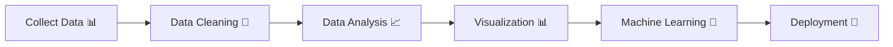

<div align="center">

# 👨‍💻 Rajkumar Dubey

### Aspiring Data Scientist • Data Analytics Enthusiast • ML Engineer


<p align="center">


</p>

</div>

---

# 🚀 About Me

🎓 B.Tech Student in **Big Data Analytics & Data Science** at **Parul University**

💡 Passionate about Data Science, Analytics, Machine Learning, and AI-driven technologies with a strong interest in building intelligent and impactful solutions using real-world data.

🔹 Skilled in Python, SQL, Data Visualization, Dashboard Development, and Data Analytics.

🔹 Hands-on experience with Machine Learning concepts, Streamlit applications, and interactive analytics dashboards.

🔹 Continuously learning modern technologies and improving problem-solving, analytical thinking, and development skills.

🔹 Open to internships, collaborations, freelance projects, and entry-level opportunities in Data Science, Analytics, and Machine Learning.

---

# 🌐 Connect With Me

<div align="center">

<a href="https://www.linkedin.com/in/raj-dubey-datascience/">

</a>

<a href="https://github.com/Rajkumarte115">

</a>

<a href="https://leetcode.com/">

</a>

<a href="https://www.kaggle.com/">

</a>

</div>

---

# 💻 Technical Skills

<div align="center">

## 🚀 Programming Languages


---

## 📊 Data Science & Analytics


---

## 🗄️ Databases & Big Data


---

## 🛠 Tools & Technologies


<br><br>


</div>

---

# 🏆 LeetCode & Problem Solving

<div align="center">


<br><br>


</div>

---

# 🚀 Featured Project

<div align="center">

## 🏅 Olympics Data Analytics & Visualization Web Application

🔹 Interactive Olympics analytics dashboard
🔹 Athlete performance analysis
🔹 Country-wise medal insights
🔹 Dynamic dashboards & visualizations
🔹 Historical Olympics trend analysis

### ⚡ Features

* Olympic medal analytics
* Interactive visual dashboards
* Data filtering & exploration
* Country-wise insights
* Athlete statistics analysis

<a href="https://github.com/Rajkumarte115/olympics-data-analytics-dashboard">

</a>

<a href="https://huggingface.co/spaces/rajkumar-dubey/olympics-data-analytics">

</a>

</div>

---

# 📂 More Projects

<div align="center">

| 🚀 Project                            | 💻 Tech Stack             | 🔥 Description                          |
| ------------------------------------- | ------------------------- | --------------------------------------- |
| **Olympics Data Analytics Dashboard** | Python, Streamlit, Pandas | Interactive Olympic analytics dashboard |
| **Sentiment Analysis System**         | Python, NLP, ML           | Text sentiment prediction system        |
| **Data Visualization Dashboard**      | Power BI, Python          | Interactive analytics & visualization   |
| **Machine Learning Models**           | Python, Scikit-learn      | Predictive ML model implementations     |
| **Analytics Web Application**         | Streamlit, SQL            | Real-world analytics web application    |

</div>

---

# 📊 GitHub Analytics

<div align="center">


<br><br>


</div>

---

# 📈 Contribution Graph

<div align="center">


</div>

---

# 🐍 Contribution Snake

<div align="center">


</div>

---

# 🎯 Career Objective

```yaml
Seeking Opportunities In:
  - Data Science
  - Data Analytics
  - Machine Learning
  - Business Intelligence
  - AI-Powered Applications
  - Data Visualization
```

---

# 📈 Current Focus

```yaml
focus:
  - Data Analytics & Visualization
  - Machine Learning Projects
  - Python Development
  - SQL & Databases
  - Dashboard Development
  - Real-World Data Projects
```

---

# 🧠 Developer Workflow



---

# 💡 Motto

<div align="center">

> "Consistency and continuous learning lead to success."

</div>

---

# 📬 Contact Me

<div align="center">

💼 LinkedIn: https://www.linkedin.com/in/raj-dubey-datascience/

💻 GitHub: https://github.com/Rajkumarte115

### 🚀 Open to:

* Data Science Internships
* Data Analytics Roles
* Machine Learning Projects
* Open Source Collaborations

</div>

---

<div align="center">

## ⭐ Thanks for Visiting My Profile


<br><br>


</div>
